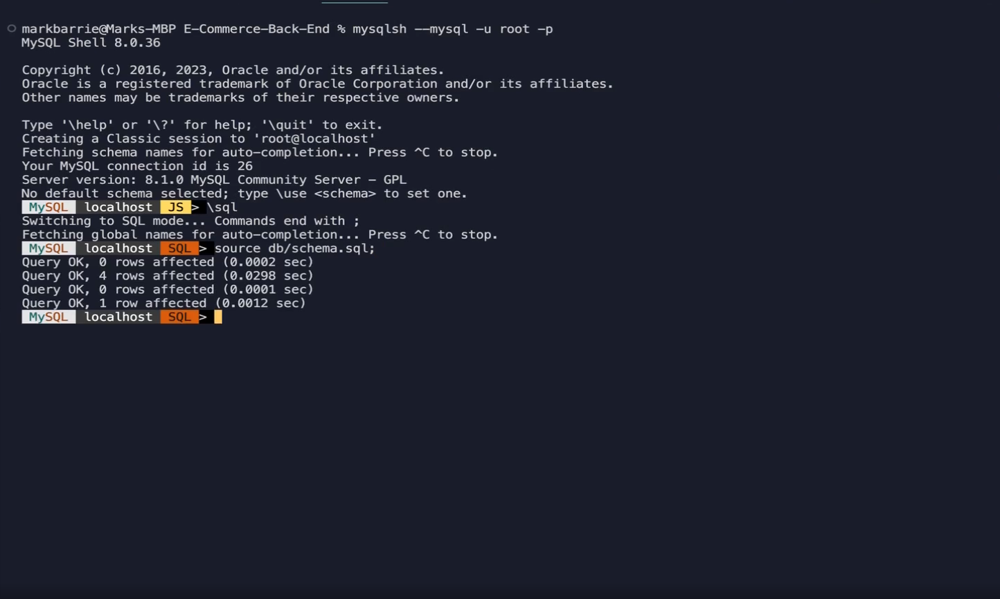
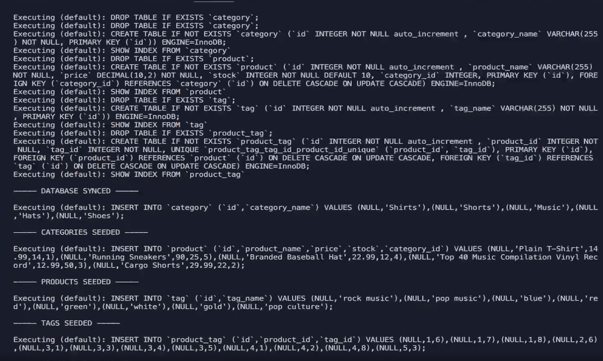
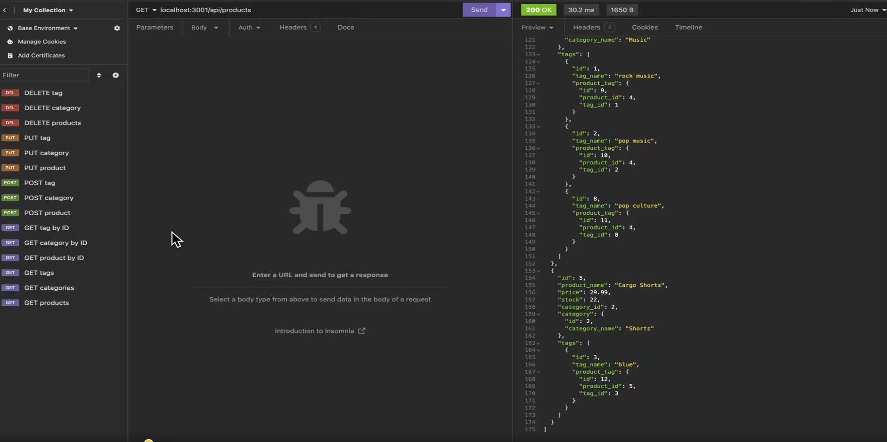
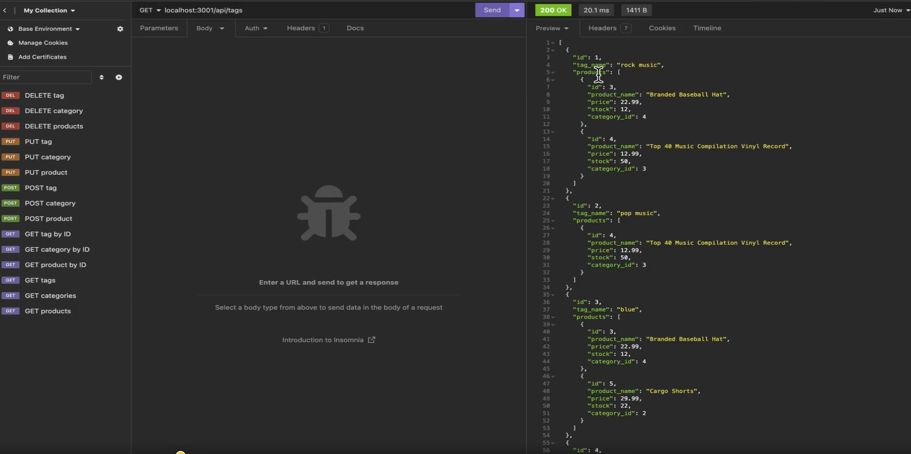
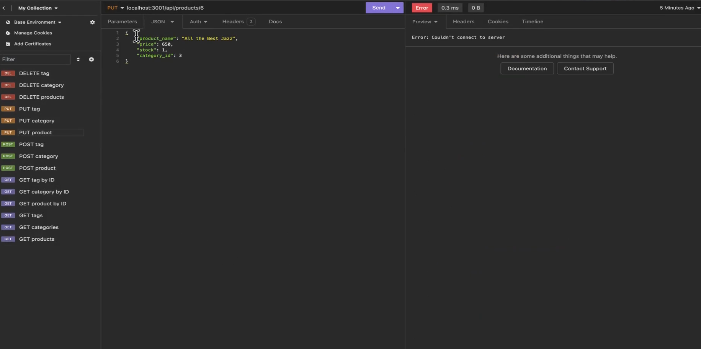

# E-Commerce Back End

## Description

This application serves as the back end for an e-commerce site. Leveraging Express.js and Sequelize, it connects to a MySQL database, allowing users to perform CRUD operations on products, categories, and tags.

## Table of Contents

- [Installation](#installation)
- [Usage](#usage)
- [Database Models](#database-models)
- [Associations](#associations)
- [API Routes](#api-routes)
- [Seeding](#seeding)
- [Screenshots](#screenshots)
- [Credits](#credits)
- [Video Walkthrough](#video-walkthrough)

## Installation

To install this application, clone the repository and run the following command to install dependencies:

```bash
npm install
```
## Usage

To use the application, follow these steps:

    Add your database name, MySQL username, and MySQL password to an environment variable file (.env).
    Execute schema and seed commands to create your database with test data.
    Start the server with the command below to sync Sequelize models to the MySQL database: npm start

## Database Models

The database contains the following models:

    Category
        id: Integer, primary key, auto-increment, not null
        category_name: String, not null

    Product
        id: Integer, primary key, auto-increment, not null
        product_name: String, not null
        price: Decimal, not null, validates as a decimal
        stock: Integer, not null, default value of 10, validates as numeric
        category_id: Integer, references Category model's id

    Tag
        id: Integer, primary key, auto-increment, not null
        tag_name: String

    ProductTag
        id: Integer, primary key, auto-increment, not null
        product_id: Integer, references Product model's id
        tag_id: Integer, references Tag model's id

## Associations

The application features the following model associations:

    A Product belongs to a single Category, whereas a Category can have many Product instances.
    A Product can belong to many Tag instances, and a Tag can have many Product instances through the ProductTag through model.

## API Routes

The following API routes are available:

    GET routes to retrieve all categories, all products, or all tags.
    GET routes to retrieve a single category, product, or tag.
    POST, PUT, and DELETE routes to create, update, and delete data in the database.

## Seeding

Run the following command to seed the database with test data: npm run seed

## Screenshots








## Credits

Developer: Mark Barrie  
Starter Code: [View the starter code](https://github.com/coding-boot-camp/fantastic-umbrella)

## Video Walkthrough

[Watch the video walkthrough](https://watch.screencastify.com/v/kLLtAMV8yQRDUnOirEQA)
